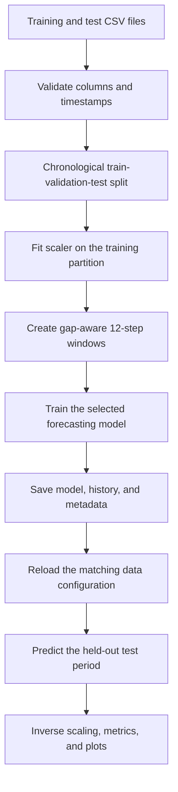

# Traffic Flow Prediction with LSTM and Temporal Attention

Research implementation associated with:

> H. Pakparvar, S. M. Matinkhah, and A. Jamshidi, "Traffic Flow Prediction in Intelligent Transportation Systems Using LSTM With Attention Mechanism," *IEEE Access*, vol. 14, 2026. [https://doi.org/10.1109/ACCESS.2026.3686508](https://doi.org/10.1109/ACCESS.2026.3686508)

The project performs one-step-ahead traffic-flow forecasting for a single sensor. Each prediction uses the previous 12 five-minute observations, corresponding to a 60-minute look-back window.

## Models

- **LSTM with temporal attention**: two 64-unit LSTM layers followed by learned temporal weighting.
- **LSTM**: matched two-layer baseline without attention.
- **GSA-KAN**: exploratory gated self-attention model with a B-spline KAN representation.
- **DeltaRelax-LSTM**: exploratory recurrent model with time-gap-aware state relaxation.

TWDGCN is not included in the runnable pipeline because the supplied dataset contains only one sensor.

## Pipeline



## Results

### Published results

These values are copied from the associated article.

| Dataset | Model | MAE | MSE | RMSE | MAPE | R2 |
|---|---|---:|---:|---:|---:|---:|
| 2016 | LSTM + Attention | 3.8967 | 28.6424 | 5.3519 | 18.61 | 0.9416 |
| 2016 | LSTM | 3.9239 | 29.2472 | 5.4081 | 18.47 | 0.9403 |
| 2016 | GSA-KAN | 5.7131 | 64.6572 | 8.0410 | 24.74 | 0.8681 |
| 2016 | TWDGCN | 4.0517 | 30.5908 | 5.5309 | 19.60 | 0.9376 |
| 2016 | DeltaRelax-LSTM | 4.0578 | 30.5902 | 5.5308 | 19.82 | 0.9376 |
| 2024 | LSTM + Attention | 5.1170 | 55.0752 | 7.4213 | 17.44 | 0.9286 |
| 2024 | LSTM | 5.1183 | 55.1830 | 7.4285 | 17.01 | 0.9285 |
| 2024 | GSA-KAN | 5.8502 | 68.7041 | 8.2888 | 20.35 | 0.9109 |
| 2024 | TWDGCN | 5.2418 | 58.1848 | 7.6279 | 17.79 | 0.9246 |
| 2024 | DeltaRelax-LSTM | 5.2923 | 59.1844 | 7.6931 | 18.06 | 0.9233 |

### Latest run of the refactored 2016 pipeline

The refactored pipeline uses chronological validation, deterministic seeding, train-fitted scaling, and timestamp-aware window generation. These results are reported separately because retraining can produce values different from the published experiment.

| Model | Samples | MAE | MSE | RMSE | SMAPE | WAPE | R2 |
|---|---:|---:|---:|---:|---:|---:|---:|
| LSTM + Attention | 4,248 | 4.1421 | 31.2521 | 5.5904 | 17.88 | 11.06 | 0.9354 |
| LSTM | 4,248 | 4.1681 | 31.4935 | 5.6119 | 18.33 | 11.13 | 0.9349 |
| GSA-KAN | 4,248 | 5.5786 | 62.9579 | 7.9346 | 21.31 | 14.90 | 0.8699 |
| DeltaRelax-LSTM | 4,308 | 4.2699 | 33.4592 | 5.7844 | 19.06 | 11.54 | 0.9318 |

The two exploratory models are reported with their evaluation sample counts. The default comparison command evaluates only the two matched LSTM models.

## Installation

Python 3.11-3.13 is recommended.

```bash
python -m venv .venv

# Windows
.venv\Scripts\activate

# Linux or macOS
source .venv/bin/activate

python -m pip install --upgrade pip
python -m pip install -r requirements.txt
```

## Usage

Train the two primary models:

```bash
python train.py --model lstm
python train.py --model lstm_no_attention
```

Evaluate them and create the metrics table and prediction overlay:

```bash
python evaluate.py
```

Exploratory models can be trained and evaluated explicitly:

```bash
python train.py --model gsa_kan
python train.py --model delta_relax_lstm
python evaluate.py --models lstm lstm_no_attention gsa_kan delta_relax_lstm
```

Create the temporal-attention report:

```bash
python analyze_attention.py
```

Create segmented pointwise error plots:

```bash
python plot_error_segments.py
```

## Project structure

```text
traffic_flow/
  data.py                 chronological splitting, scaling, and windows
  models.py               model and custom-layer definitions
  metrics.py              regression and percentage-error metrics
data/
  train.csv               2016 training data
  test.csv                2016 held-out data
train.py                  training entry point
evaluate.py               evaluation entry point
analyze_attention.py      temporal-attention analysis
plot_error_segments.py    absolute and squared error plots
preprocess.py             optional preprocessing for raw CSV data
tests/                    data, metric, and model serialization tests
```

Training writes models, histories, and metadata to `artifacts/models/`. Evaluation and plotting commands write their outputs to the corresponding `artifacts/` subdirectories.

## Tests

```bash
python -m pip install -r requirements-dev.txt
python -m pytest -q
```

## Citation

Citation metadata are available in [`CITATION.cff`](CITATION.cff). If this repository supports your work, please cite the associated IEEE Access article.
